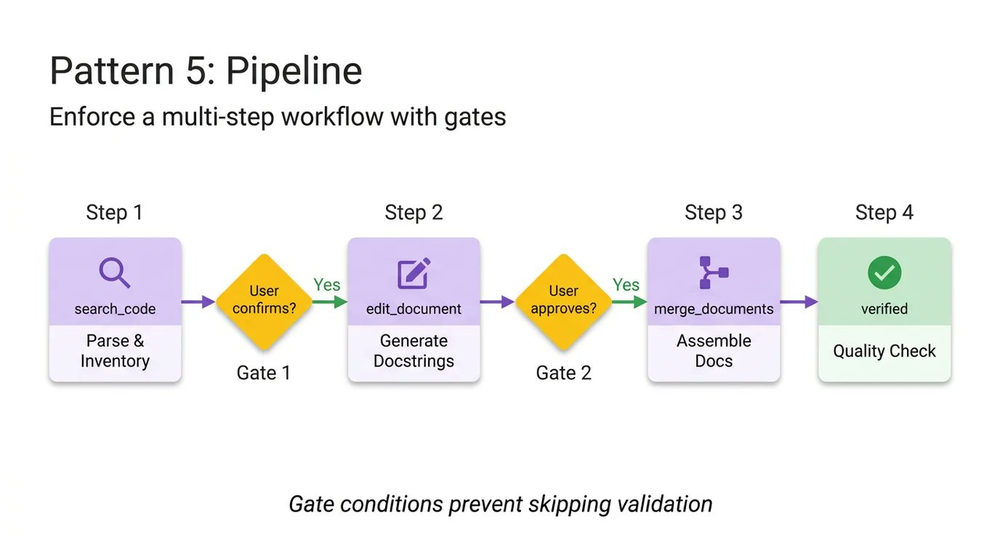
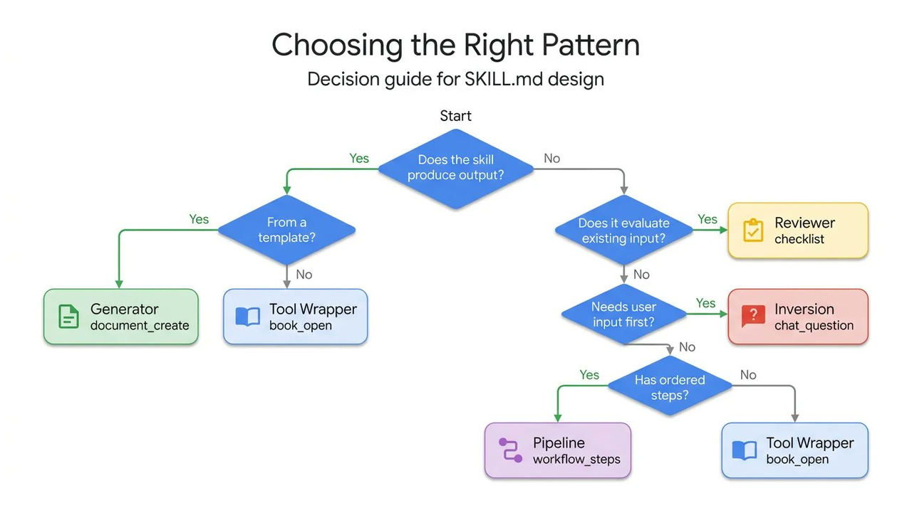

> 学习目标：掌握如何让多步骤任务按流程执行，避免跳步骤或执行到一半卡死

---

## 引言

多步骤任务总有跳步骤——为什么？

比如一个发布流程：

1. 更新版本号
2. 更新 CHANGELOG
3. 跑测试
4. 构建
5. 发布到 npm
6. 创建 Git tag
7. 推送到 GitHub

如果你当成一句 prompt，模型中途可能会偷懒：跳过测试、忘记推 tag、构建失败也继续发布。

**Pipeline 模式**解决的就是这个问题。

---

## 📚 核心问题

**多步骤任务容易跳步骤或执行到一半卡死。**

常见表现：

- 发布流程跳过测试步骤
- 构建失败了也继续发布
- Git tag 创建了但没推送
- 关键步骤遗漏导致返工

---

## 💡 Pipeline 的解决方案

**核心思想**：直接把 SKILL.md 写成工作流，每一步都有验证。


**设计要点**：

- 定义第一步做什么、第二步做什么
- 定义什么时候能进入下一步（Gate）
- 中间放显式门控（Gate）

**Gate 机制**：

- 每一步都有明确的验证条件
- 只有验证通过，才能进入下一步
- 关键步骤失败时，定义失败后的行为

---

## 🔧 Pipeline SKILL.md 示例

**场景**：npm 包发布流程

```text
---
name: npm-publish
description: Publish npm package with version bump, changelog, and git tag.
---

# npm 包发布流程

⚠️ 重要：必须按顺序执行每一步，不能跳过。

## 步骤 1：更新版本号

执行：npm version <version>

验证：
  git log -1 --pretty=%B  # 检查 commit message
  cat package.json | grep '"version"'  # 确认版本号已更新

✓ Gate: 确认版本号已更新，commit 已创建

---

## 步骤 2：更新 CHANGELOG

执行：conventional-changelog -p angular -i CHANGELOG.md -s

验证：git diff CHANGELOG.md  # 检查变更

✓ Gate: 确认 CHANGELOG 已更新

---

## 步骤 3：跑测试

执行：npm test

验证：所有测试通过

✓ Gate: 确认测试全部通过

⚠️ 如果测试失败：
  - 停止流程
  - 报告失败的测试
  - 等待用户修复

---

## 步骤 4：构建

执行：npm run build

验证：ls dist/  # 确认构建产物存在

✓ Gate: 确认构建成功

---

## 步骤 5：发布到 npm

执行：npm publish

验证：npm view <package-name> version  # 确认已发布

✓ Gate: 确认发布成功

---

## 步骤 6：创建 Git tag 并推送

执行：
  git tag v<version>
  git push origin v<version>
  git push origin main

验证：git tag -l  # 确认 tag 存在

✓ Gate: 确认 tag 已推送

---

## 完成检查清单

发布完成后，确认以下事项：

- [ ] 版本号已更新
- [ ] CHANGELOG 已更新
- [ ] 测试全部通过
- [ ] 构建成功
- [ ] npm 发布成功
- [ ] Git tag 已创建并推送
- [ ] 代码已推送到 GitHub
```

**关键设计**：

1. **Gate 机制**：每一步都有明确的验证条件
2. **失败处理**：关键步骤（如测试）定义失败后的行为
3. **检查清单**：最后提供完整的验证列表

---

## 📌 经典案例

### 案例：CI/CD 部署流水线

**场景**：团队需要一个标准化的部署流程，避免跳步骤或遗漏。

**问题**：手动部署时经常出现：
- 跳过测试步骤
- 构建失败也继续部署
- 忘记更新版本号
- 部署后忘记通知团队

**Pipeline 方案**：

**SKILL.md 核心内容**：

````markdown
# CI/CD 部署流水线

⚠️ 重要：必须按顺序执行每一步，不能跳过。

## 步骤 1：代码检查

执行：
```bash
npm run lint
npm run type-check
```

验证：无 lint 错误，无类型错误

✓ Gate: 代码检查通过

---

## 步骤 2：单元测试

执行：
```bash
npm run test:unit
```

验证：测试覆盖率 ≥ 80%，所有测试通过

✓ Gate: 单元测试通过

⚠️ 如果测试失败：
- 停止流程
- 报告失败的测试
- 等待修复

---

## 步骤 3：集成测试

执行：
```bash
npm run test:integration
```

验证：所有集成测试通过

✓ Gate: 集成测试通过

---

## 步骤 4：构建

执行：
```bash
npm run build
```

验证：
```bash
ls -lh dist/
du -sh dist/
```

✓ Gate: 构建成功，产物大小合理

---

## 步骤 5：部署到测试环境

执行：
```bash
npm run deploy:staging
```

验证：
- 访问 staging.example.com/health
- 确认返回 200 OK

✓ Gate: 测试环境部署成功

---

## 步骤 6：冒烟测试

执行：
```bash
npm run test:smoke --env=staging
```

验证：关键功能可用

✓ Gate: 冒烟测试通过

---

## 步骤 7：部署到生产环境

执行：
```bash
npm run deploy:production
```

验证：
- 访问 example.com/health
- 确认返回 200 OK

✓ Gate: 生产环境部署成功

---

## 步骤 8：通知团队

执行：
```bash
curl -X POST $SLACK_WEBHOOK_URL -d '{"text":"部署成功：v'$VERSION'"}'
```

验证：Slack 消息发送成功

✓ Gate: 团队已通知

---

## 完成检查清单

部署完成后，确认以下事项：

- [ ] 代码检查通过
- [ ] 单元测试通过（覆盖率 ≥ 80%）
- [ ] 集成测试通过
- [ ] 构建成功
- [ ] 测试环境部署成功
- [ ] 冒烟测试通过
- [ ] 生产环境部署成功
- [ ] 团队已通知
````

**案例解析**：

1. **步骤显式化**：每一步都明确写出，不会遗漏
2. **Gate 机制**：每步都有验证条件，通过才能继续
3. **失败处理**：测试失败时明确停止流程，而不是继续部署
4. **可追溯**：完整的检查清单，便于审计

**实际效果对比**：

| 方案 | 部署失败率 | 回滚次数 | 部署时间 |
|------|-----------|---------|---------|
| 手动部署 | 28% | 平均每月 3 次 | 不稳定（30-90 分钟） |
| Pipeline 模式 | 5% | 平均每月 0.2 次 | 稳定（20 分钟） |

**关键 Gate 示例**：

```bash
# Gate: 单元测试通过
if npm run test:unit; then
    echo "✓ Gate passed: Unit tests OK"
else
    echo "✗ Gate failed: Unit tests failed"
    echo "Stopping deployment pipeline"
    exit 1
fi
```

**团队反馈**：
"以前部署总是提心吊胆，现在有了 Pipeline，每一步都有检查，部署成功率从 72% 提升到 95%。"  

---

## ✅ 适用场景

- **发布流程**：npm、Docker、应用商店等
- **部署流程**：测试环境 → 生产环境
- **多步骤任务**：顺序严格、步骤可验证
- **容易遗漏步骤的任务**：关键步骤不能跳过

到这里，五种 Skill 设计模式已经介绍完毕。Pipeline 是最后一种模式，也适合在这里回头看整体：什么时候该用 Pipeline，什么时候该用其他模式，以及复杂 Skill 如何把多种模式组合起来。

---

## 🧭 五种模式如何选型

真正写 Skill 时，不是先问“我喜欢哪种模式”，而是先判断任务本身的结构。


### 选型判断树

**第一问：这个 Skill 是否主要生成输出？**

如果答案是“是”：

- **输出来自固定模板** → 选 **Generator 模式**，例如报告、方案、PR 描述、API 文档
- **输出来自某个工具或专业知识封装** → 选 **ToolWrapper 模式**，例如 FastAPI 规范、gcloud 操作、数据库查询

如果答案是“否”：

- **它主要评估已有内容** → 选 **Reviewer 模式**，例如代码审查、文档质检、安全检查
- **它需要先问清用户需求** → 选 **Inversion 模式**，例如需求澄清、项目规划、方案设计
- **它有严格先后顺序** → 选 **Pipeline 模式**，例如发布、部署、迁移、批量改造
- **以上都不是，只是执行单一动作** → 仍然回到 **ToolWrapper 模式**

### 快速选择表

| 任务特征 | 首选模式 | 解决的问题 |
|---------|---------|-----------|
| 需要适配特定技术栈、工具或团队规范 | ToolWrapper | Agent 缺少领域知识 |
| 需要稳定生成统一结构的内容 | Generator | 输出格式不稳定 |
| 需要检查、评分、指出问题 | Reviewer | 审查标准混乱 |
| 需求模糊，需要先问清楚 | Inversion | Agent 盲目猜测 |
| 多步骤、强顺序、不能跳步 | Pipeline | 流程遗漏与执行失控 |

---

## 🧩 五种模式可以自由组合

五种模式不是互斥分类，而是可以组合的设计积木。单一模式适合简单场景，生产级 Skill 往往是多个模式叠加。

### 常见组合方式

1. **Pipeline + Reviewer**：先按流程执行，最后按检查清单自检。例如“代码迁移流水线”最后嵌入质量审查。
2. **Inversion + Generator**：先问清需求，再按模板生成。例如“项目规划 Skill”先访谈，再输出标准方案。
3. **ToolWrapper + Reviewer**：先加载领域规范，再按规范审查。例如“FastAPI 代码审查 Skill”先加载框架规则，再检查代码。
4. **Pipeline + ToolWrapper**：每个步骤按需加载不同工具知识。例如“云资源部署 Skill”在不同步骤加载 IAM、网络、监控规则。
5. **Inversion + Pipeline**：先确认目标和约束，再进入严格流程。例如“生产迁移 Skill”先确认窗口期、回滚方案，再执行迁移步骤。

### 为什么 Pipeline 经常作为外层骨架

复杂 Skill 往往不是“只做一件事”，而是多个阶段串起来：先问需求、再生成内容、再执行、再审查。此时 **Pipeline 适合做外层骨架**，其他模式嵌入到具体步骤中：

```text
Step 1：Inversion —— 问清目标、约束、风险
Step 2：ToolWrapper —— 加载领域规范或工具说明
Step 3：Generator —— 生成计划、配置或文档
Step 4：Reviewer —— 按清单审查输出
Step 5：Gate —— 验证通过后才进入下一步
```

这样既能保证流程不乱，又能让每一步只加载当前需要的资料，符合 Skill 的渐进式披露原则。

---

## 🎯 本节核心观点

**Pipeline 模式的三个关键**：

1. **步骤显式化**：每一步都写在 SKILL.md 中
2. **Gate 机制**：每一步都有验证条件，通过才能继续
3. **失败处理**：关键步骤失败时，定义行为而不是继续

**五种模式的完整关系**：

- ToolWrapper 解决领域知识注入
- Generator 解决结构化输出
- Reviewer 解决质量检查
- Inversion 解决需求澄清
- Pipeline 解决流程编排，并常作为复杂 Skill 的外层骨架

---

## 🔗 下节预告

下一节开始我们进入 **实战篇**：如何写一个真正能用的 Skill。

---

## 🔗 章节导航

← [上一章：10-Inversion 模式——先问清需求再开工](./10-Inversion 模式——先问清需求再开工.md) | [下一章：12-不写已知知识——Agent 已经很聪明](./12-不写已知知识——Agent 已经很聪明.md) →
