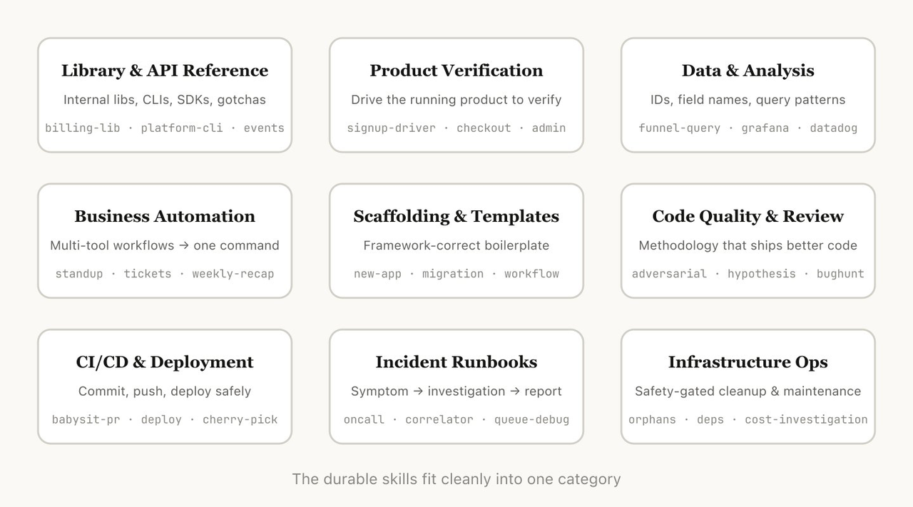
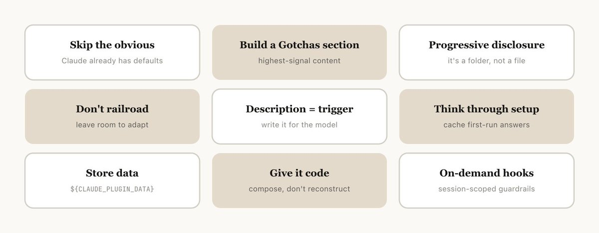

> 学习目标：从 Anthropic 内部的 9 大 Skill 分类中，学会诊断团队能力缺口，把关键经验沉淀成可调用、可执行、可验证的 Agent 能力

---

> 这是本教程的参考资料，用于帮助团队诊断能力缺口，不作为核心教程内容。
>
> **参考来源**：Thariq (Anthropic核心开发者) 《Lessons from Building Claude Code: How We Use Skills》
>
> **阅读对象**：已经学完本教程前 27 章，希望参考 Anthropic 内部实践来建设团队 Skill 能力的读者。

## 先给结论

Anthropic 的 9 大 Skill 分类最值得学的不是"它有很多 Skill"，而是它揭示了一个关键事实：

**AI 会放大组织已有的能力，也会放大能力缺口。**

如果关键经验还没有 Skill 化，AI 产出速度越快，组织混乱程度也越快。

这张地图的核心价值：

- **诊断能力缺口**：看清哪些关键经验还停留在人脑里
- **指导 Skill 建设**：知道优先建设哪些环节的 Skill
- **形成能力链条**：认知→生产→验证→交付，缺一不可

这正好对应本教程反复强调的观点：**Skill 不是资料库，而是决策框架和执行边界**。

---

## 能力地图：从认知到交付的四环节

Thariq梳理了Anthropic构建Claude Code时使用的数百项技能，归纳出9个主流类别，最优秀的技能通常能清晰地归属于某一类；而较模糊的技能则可能跨越多个类别。这有助于思考自己组织内部是否缺少某些关键技能。

Skill 不是孤立的，它们组成了一条完整的能力链条：

```text
认知 → 生产 → 验证 → 交付
```

| 环节 | 阶段任务 | Skill 类别 | 解决的问题 |
|------|---------|-----------|-----------|
| **认知** | 让 Agent 先理解系统、接上数据、掌握排障入口 | 库与接口文档、数据查询分析、故障排查手册 | Agent 不知道自己面对什么系统，不知道从哪里获得理解 |
| **生产** | 让 Agent 稳定地产出代码和流程结果 | 代码脚手架模板、业务流程自动化 | Agent 每次从零起步，产出容易漂移 |
| **验证** | 让 Agent 不只是产出，还能做质量审查、完成产品验证 | 代码质量审查、产品验证 | Agent 能不能证明自己做对了 |
| **交付** | 把结果推进到代码合并、部署和后续运维 | CI/CD、基础设施运维 | 一到部署就必须切回人工，能力链条断了一半 |

如果某个环节缺失，整个链条就会断掉。

---

## 9 大 Skill 分类详细解析

### 认知环节：让 Agent 先理解系统

解决的问题：Agent 到底知不知道自己面对的是什么系统？从哪里获得理解？遇到异常时从哪里开始查？

#### 1. 库与接口参考类

**类型**：ToolWrapper 模式 + Gotchas 板块

**定位**：解释如何正确使用库、命令行工具或 SDK 的技能。这些技能既适用于内部库，也适用于 Claude Code 有时难以处理的常用库。

**特点**：
- 文件夹内通常会存放代码片段
- 整理出使用过程中的常见坑点（gotchas）
- 重点标注边界场景、高危用法

**示例**：
- 内部计费库 Skill，重点标注边界场景、高危用法
- 内部平台命令行工具 Skill，附带每条子命令的使用场景
- `frontend-design` —— 前端设计规范及坑点

**最有价值的内容**：
- 最常用的调用方式
- 参考片段
- 文档里没写但团队反复踩坑的 gotchas

**原则**：不要写 Agent 本来就知道的东西，要写它推不出来的东西。

**教程连接**：对应第 07 章 ToolWrapper 模式和第 13 章 Gotchas 坑点。它把内部库的"使用陷阱"整理成 Agent 可主动规避的规则。

---

#### 2. 数据查询与分析类

**类型**：ToolWrapper + Context 管理

**定位**：对接企业数据平台、监控系统，使用凭据获取数据的库、特定的仪表板 ID 等，以及常见工作流程或获取数据的方法说明。

**特点**：
- 内置数据查询依赖、账号凭证、仪表盘编号等信息
- 标注常规分析流程与查询语句
- 包含标准用户 ID 的表格

**示例**：
- 漏斗数据查询 Skill，"我需要参与哪些事件才能看到从注册→激活→付费的转化路径"
- 用户分群对比 Skill，比较两个队列的留存率或转化率，标记统计上显著的差异
- Grafana Skill，数据源 UID、集群名称、问题→仪表板查找表

**解决的问题**：分析任务空转 —— 数据入口在哪？

**教程连接**：对应第 14 章文件组织与渐进式披露。它把数据源的访问方式、常用查询语句整理成 Agent 能直接调用的东西，避免"我要分析数据，但不知道从哪里拉"。

---

#### 3. 运维故障处理手册类

**类型**：Pipeline 模式 + 结构化输出

**定位**：根据告警、报错、现象，一步步完成故障排查，并输出结构化报告。将工程师的排障思路沉淀成组织可以复用的资产。

**特点**：
- 梳理"问题现象-排查工具-查询方式"的对应关系
- 适配线上突发问题处理
- 接收症状（Slack 告警、错误签名、请求 ID），自动查日志、查监控、串链路

**示例**：
- 服务调试 Skill，将症状映射到工具，进而关联至高流量服务的查询模式
- Oncall Skill，拉取告警信息、排查常见问题、整理结果
- 日志关联检索 Skill，根据请求 ID，从所有可能涉及该请求的系统中提取匹配的日志

**价值**：承接低频但认知负担极高的问题，把资深工程师排障思路变成组织可复用的基础设施。

**教程连接**：对应第 11 章 Pipeline 模式。它把"排障"这个非结构化能力写成症状→工具→查询模式的 Pipeline，让排障能力可复用。

---

### 生产环节：让 Agent 稳定地产出

解决的问题：Agent 怎么稳定地产出代码、流程结果和标准化产物，而不是每次从零起步。

#### 4. 代码脚手架与模板类

**类型**：Generator 模式 + 文件组织

**定位**：自动生成项目基础代码、文件模板，省去重复编写样板代码的工作。使得团队的项目结构和风格保持一致。

**特点**：
- 可搭配各类可组合脚本
- 尤其适合需要自然语言进行要求、而且这些要求无法完全靠代码实现的场景
- 给 Agent 一套稳定的起手式

**示例**：
- 新服务/工作流模板 Skill，生成新的服务/工作流/处理器
- 数据库迁移文件模板 Skill，迁移文件模板及常见问题
- 内部应用初始化 Skill，预先集成权限、日志、部署配置

**问题**：没有这类 Skill，Agent 每次重新决定目录结构、命名习惯、文件分层，产出容易漂。

**教程连接**：对应第 08 章 Generator 模式。它把团队的"代码风格偏好"固化成模板，Agent 只需要填充具体业务逻辑。

---

#### 5. 业务流程与团队自动化类

**类型**：Pipeline + 数据记录

**定位**：把高频、重复的日常工作流程封装为一键执行的能力。这类 Skill 是最容易被快速感知到收益的一类。

**特点**：
- 主体指令逻辑简单
- 往往会依赖其他技能或 MCP 协议
- 支持用日志文件留存历史执行记录，让智能体保持行为一致

**示例**：
- 站会简报 Skill，汇总你的工单跟踪、GitHub 活动以及之前的 Slack 内容，生成格式化的站会报告
- 工单创建 Skill，强制执行数据结构（有效枚举值、必填字段），并执行创建后的流程
- 每周工作汇总 Skill，格式化后的回顾文章

**价值**：持续吃掉团队低价值、重复性劳动，最容易被快速感知收益。

**教程连接**：对应第 16 章设置流程与内存。它用 config.json 和日志追加让 Skill 有记忆，避免每次都问相同问题。

---

### 验证环节：让 Agent 证明自己做对了

解决的问题：Agent 能不能证明自己写出来的东西真的能工作。

#### 6. 代码质量与审查类

**类型**：Reviewer 模式 + Adversarial Review

**定位**：落地团队代码规范，完成自动化代码评审。是值得反复打磨的一类 Skill。

**特点**：
- 搭配确定性执行脚本与工具，稳定性强
- 可结合钩子、GitHub 自动化流程自动运行
- Fresh eye review：制造新鲜视角专门挑毛病，对抗模型的自我一致性偏差

**示例**：
- Adversarial Review Skill，启动子代理反复评审、修复问题，直至仅存细节优化
- 代码风格 Skill，强制执行代码风格，特别是 Claude 默认情况下表现不佳的那些风格
- 测试 Skill，如何编写测试以及测试什么的指导说明

**关键**：不要只让 Agent 用刚写完代码的视角回头审自己。

**教程连接**：对应第 09 章 Reviewer 模式。它把"代码审查"从主观判断变成可执行的检查规则，并用 Adversarial Review 对抗模型自我认同偏差。

---

#### 7. 产品验证类

**类型**：ToolWrapper + Runtime Verification

**定位**：定义代码、功能的测试与校验规则，用来核验代码运行结果是否符合预期。

**特点**：
- 一般会搭配 Playwright、tmux 等外部工具使用
- 技能内部包含各类执行脚本
- 可以实现录屏、分步状态断言等能力，保障输出结果准确

**示例**：
- 自动化测试 Skill，无头浏览器走完全流程，分步校验状态
- 收银台校验 Skill，使用测试卡完成支付流程，核对订单状态

**重要技巧**：
- 让 Agent 录制输出视频（看到完整执行过程）
- 编程式断言强制检查状态

**核心**：让 Agent 有能力证明自己做对了，而不只是交差。

**价值**：验证类 Skill 值得工程师花一周时间专门打磨，真正决定质量的不只是生成能力，还有反馈闭环。

**教程连接**：对应第 18 章脚本——给 Agent 可调用的代码。它把"验证"封装成脚本，Agent 调用脚本即可证明自己，不需要重新实现测试逻辑。

---

### 交付环节：把结果推进到系统里

解决的问题：Agent 怎么把结果真正推进到系统里，并在后续阶段持续维护。

#### 8. 持续集成/部署类

**类型**：Pipeline + Gate

**定位**：完成代码拉取、推送、上线部署等工程化操作。

**特点**：
- 可引用其他技能获取所需信息
- 覆盖完整上线链路
- 负责 PR 监控、合并冲突处理、条件满足后自动合并
- 负责服务部署、灰度发布、盯关键指标、异常时自动回滚

**示例**：
- `babysit-pr` Skill，监控合并请求、重试异常 CI、解决冲突、开启自动合并
- 服务部署 Skill，编译、冒烟测试、灰度放量、异常自动回滚
- Cherry-pick Skill，生产代码择优合并技能

**问题**：很多团队"一到部署就必须完全切回人工"，说明 Agent 能力链条只走到一半。

**教程连接**：对应第 11 章 Pipeline 模式和第 19 章 Hooks 按需激活。它把部署写成有 Gate 的流程，并可通过 PreToolUse Hook 阻断危险操作。

---

#### 9. 基础设施运维类

**类型**：低自由度 Pipeline + 安全护栏

**定位**：完成服务器、容器、存储等基础设施的日常维护操作（高风险动作）。

**特点**：
- 部分操作存在风险，技能内会增加防护规则
- 引导工程师遵循最佳实践
- 明确 Always / Ask First / Never 三层边界

**示例**：
- 冗余资源清理 Skill，扫描闲置资源、通知团队、等待确认后批量清理
- 依赖包管理审批 Skill，组织内的依赖审批工作流程
- 成本调查 Skill，"为什么我们的存储/出站费用突然激增"，并附上具体的存储桶和查询模式

**特别强调护栏**：删资源、改环境、切流量这些事一旦失控代价很高，先把风险边界写清楚，再谈自动化。

**教程连接**：对应第 27 章 Skill 安全三原则。它把"安全意识"写成 Always / Ask First / Never，可直接迁移到团队 Skill。

---

## 与教程五大模式的映射

如果用本教程的五大设计模式来看，Anthropic 的 9 大 Skill 分类几乎覆盖了所有模式：

| 教程模式 | 对应 Skill | 学习重点 |
|----------|------------|----------|
| **ToolWrapper 模式** | 库与接口参考、数据查询分析、产品验证 | 把内部库、数据源、验证工具的访问规则封装起来 |
| **Pipeline 模式** | 故障排查手册、业务流程自动化、CI/CD、基础设施运维 | 把多步骤工作流写成阶段、Gate 和退出条件 |
| **Reviewer 模式** | 代码质量审查、基础设施运维（安全护栏） | 流程与检查维度分离，输出结构化审查结果 |
| **Generator 模式** | 代码脚手架模板 | 固定输出结构：项目模板、文件组织、代码风格 |
| **Inversion 模式** | （未在 9 类中显式列出，但所有 Skill 的 description 都需要） | description 写触发条件，让 Agent 判断何时调用 |

最值得学习的是：Anthropic 把多个模式组合起来，形成完整的能力链条：

```text
认知（ToolWrapper + Pipeline）
  -> 生产（Generator + Pipeline）
  -> 验证（Reviewer + ToolWrapper）
  -> 交付（Pipeline + 安全护栏）
```

这不是单个 Skill，而是一套 **研发全生命周期 Skill Pack**。

---

## 10 条核心实践：写出优质 Skill 的秘诀

这是 Anthropic 在海量实践中总结出的实用技巧，也是打造好用 Skill 的关键：

### 1. 不写常识内容（Don't State the Obvious）

Claude 本身具备丰富的编码知识，Skill 里不要堆砌基础常识，重点补充它不了解的内部规则、特殊用法、定制化要求。

**教程连接**：对应第 13 章"不写已知知识——Agent 已经很聪明"。

**示例**：
- ❌ 教 Agent "什么是 REST API"
- ✅ 补充"我们团队的 REST API 规范：必须分页、错误码格式、认证方式"

---

### 2. 专门增设「踩坑清单」板块（Build a Gotchas Section）

这是 Skill 里价值最高的内容。持续收集智能体使用过程中频繁出错的场景，不断更新到清单中，提前规避问题。

**教程连接**：对应第 13 章"Gotchas 坑点——最有价值的内容是踩过的坑"。

**示例结构**：

```markdown
## Gotchas

### 坑点 1：权限检查遗漏
- **现象**：用户报告"无权访问"，但代码里有权限判断
- **问题**：权限判断在 DB 事务之前，事务失败回滚后权限状态不一致
- **解决**：权限检查必须在事务成功提交后执行
```

---

### 3. 善用文件夹与渐进式披露（Use the File System & Progressive Disclosure）

充分利用文件夹结构拆分内容，把详细文档、示例、模板分到不同子文件中，让智能体按需读取，合理控制上下文大小。

**教程连接**：对应第 14 章"文件组织与渐进式披露——Skill 是文件夹不是文件"。

**示例结构**：

```
my-skill/
├── SKILL.md          # 核心逻辑（< 200 行）
├── gotchas.md        # 详细坑点记录
├── examples.md       # Before/After 示例
├── references/
│   ├── advanced.md   # 高级用法
│   └── checklist.md  # 检查清单
└── scripts/
    └── helper.py     # 辅助脚本
```

---

### 4. 指令留足灵活空间（Avoid Railroading Claude）

不要把指令写得过于死板、限制过多。给到必要规则的同时，保留适配不同场景的弹性，避免功能僵化。也就是给预期结果，不限定实现路径。

**教程连接**：对应第 15 章"避免过度约束——约束目标，不约束路径"。

**示例**：
- ❌ "第一步检查文件是否存在，第二步读取文件，第三步解析 JSON"
- ✅ "确保配置文件格式正确且必需字段存在。如果格式错误，报告具体问题并建议修复"

---

### 5. 完善初始化配置（Think through the Setup）

某些 Skill 可能需要根据用户的上下文进行设置。例如，如果你创建一个将每日站会内容发布到 Slack 的技能，你可能希望 Claude 询问应该发布到哪个 Slack 频道。

一个很好的做法是，将此设置信息存储在技能目录中的 `config.json` 文件里。如果配置未设置，代理可以向用户询问相关信息。

**教程连接**：对应第 16 章"设置流程与内存——让 Skill 有记忆"。

**示例**：

```json
// config.json
{
  "slack_channel": null,  // 首次使用时询问
  "report_time": "09:00",
  "timezone": "Asia/Shanghai"
}
```

---

### 6. 重视技能描述字段（Write Good Descriptions）

当 Claude Code 开始一次会话时，它会列出所有可用技能及其描述。这个列表是 Claude 用来判断"是否有适用于此请求的技能"的依据。这意味着描述字段并非摘要，而是说明在何种情况下应触发该技能。

**教程连接**：对应第 03 章"YAML Frontmatter 的精髓——写好 description 是成功的一半"。

**示例**：

```yaml
# ❌ 错误写法
description: 这是一个帮助团队生成周报的 Skill

# ✅ 正确写法
description: 当用户说"生成周报"、"本周总结"、"周报汇总"、"weekly report"时触发。自动汇总任务系统、代码仓库和日历活动，生成结构化周报。
```

---

### 7. 合理使用数据记录能力（Leverage Memory）

可以用日志、JSON、数据库等文件留存执行历史，让智能体参考过往记录，保证行为连贯；官方也提供了专属稳定目录存放数据，避免升级 Skill 时数据丢失。

**教程连接**：对应第 16 章"设置流程与内存——让 Skill 有记忆"。

**示例**：

```markdown
## 历史记录

执行结果将追加到 `~/.claude/skills/my-skill/history.log`，格式：

```
[2026-06-19 09:00] 用户：张三 | 报告：站会简报 | 频道：#daily-standup
```

下次执行时，Agent 会参考历史记录，保持格式和频道一致性。
```

---

### 8. 多内置可执行脚本（Provide Stable Scripts）

把通用工具函数、执行脚本放进技能，让智能体专注于流程组合，不用反复编写基础代码。

**教程连接**：对应第 17 章"脚本——给 Agent 可调用的代码"。

**示例**：

```python
# scripts/data_helper.py

def get_funnel_data(start_date, end_date):
    """从数据平台拉取漏斗数据"""
    # 具体实现...
    pass

def calculate_conversion_rate(events):
    """计算转化率"""
    # 具体实现...
    pass
```

Agent 可以直接调用这些函数，不需要重新实现数据获取逻辑。

---

### 9. 按需配置动态钩子（Use Hooks）

技能中可以包含在调用时被激活的钩子。针对高危操作、临时约束场景配置钩子，在调用对应技能时生效。

**教程连接**：对应第 18 章"Hooks——给 Skill 临时规则"。

**示例**：

```yaml
# SKILL.md
---
name: careful
description: Arms strict guardrails for this session. Invoke when touching
  production systems, running migrations, or operating in restricted
  directories. Blocks rm -rf, DROP TABLE, force-push, and kubectl delete.
hooks:
  PreToolUse:
    - matcher: Bash
      hooks:
        - type: command
          command: .claude/hooks/block-destructive.sh
---

You are operating in careful mode. Every destructive command will be blocked.
Confirm with the user before proceeding with any irreversible operation.
```

---

### 10. 组合技能（Compose Skills）

你可能需要一些相互依赖的技能。例如，你可以有一个文件上传技能用于上传文件，以及一个生成 CSV 文件并上传的技能。

你可以在一个 Skill 中直接通过名称引用其他技能，如果这些技能已安装，模型会自动调用它们。

**教程连接**：对应第 26 章"Skill 的长期维护与团队管理"。

**示例**：

```markdown
## 工作流程

1. 使用 `csv-generator` Skill 生成 CSV 文件
2. 使用 `file-uploader` Skill 上传生成的文件
3. 发送通知到 Slack 频道
```

---

## 团队 Skill 运营与管理

### 1. 分享 Skill 的三个阶段

1. **小范围试用**：Skill 完成基础功能、经过内部实测可用后，就可以小范围分享给团队试用
2. **正式纳入公共库**：Skill 获得较多同事认可、使用频次变高，确认具备通用价值后，正式纳入团队公共技能库
3. **提前做内容筛选**：避免上线重复、劣质的 Skill

---

### 2. 两种主流分发方式

| 方式 | 适用场景 | 优点 | 缺点 |
|------|---------|------|------|
| **代码仓库内嵌** | 小型团队、仓库数量少 | 同仓库成员可直接使用 | Skill 会小幅增加模型上下文负载 |
| **插件市场分发** | 团队规模扩大后使用 | 由使用者按需安装，灵活可控 | 需要搭建和维护内部插件市场 |

**代码仓库内嵌示例**：

```
./.claude/skills/
├── code-review/
├── weekly-report/
└── data-analysis/
```

---

### 3. 度量 Skill 使用情况

为了了解某个 Skill 的使用情况，可以使用 PreToolUse Hook 记录公司内部的 Skill 使用情况。这样就能发现哪些 Skill 受欢迎，或与预期相比触发频率过低。

**配置示例**：

```json
// ~/.claude/settings.json
{
  "hooks": {
    "PreToolUse": [{
      "matcher": "Skill",
      "hooks": [{ "type": "command", "command": "~/.claude/hooks/log-skill.sh" }]
    }]
  }
}
```

**日志脚本示例**：

```bash
#!/bin/bash
# ~/.claude/hooks/log-skill.sh

# stdin is the hook payload: { tool_name, tool_input: { skill, args }, session_id, ... }
# matcher already filtered to Skill, so no tool_name check needed
payload=$(cat)
skill=$(jq -r '.tool_input.skill' <<< "$payload")
args=$(jq -r '.tool_input.args // ""' <<< "$payload")

echo "$(date -u +%s)  $USER   $skill  $args" >> ~/.claude/skill-usage.log
```

**度量指标**：
- 触发频次
- 使用者分布
- 触发失败率（触发但 Agent 未执行）
- 用户满意度反馈

**教程连接**：对应第 24 章"六类评估指标——量化 Skill 表现"。

---

## 如何使用这张地图诊断团队能力

### 第一步：画出团队现有的 Skill 地图

把自己团队现有的 Skill 摆上去，按 9 大类别分类：

```markdown
## 我们团队的 Skill 地图

### 认知环节
- ✅ 内部库文档：已有 3 个 Skill
- ⚠️ 数据查询分析：只有 1 个，且不完善
- ❌ 故障排查手册：完全缺失

### 生产环节
- ✅ 代码脚手架：已有 2 个 Skill
- ⚠️ 业务流程自动化：只有周报生成，其他缺失

### 验证环节
- ⚠️ 代码质量审查：有 ESLint 但没有 Agent 审查 Skill
- ❌ 产品验证：完全缺失

### 交付环节
- ⚠️ CI/CD：有部署流程但未 Skill 化
- ❌ 基础设施运维：完全缺失
```

---

### 第二步：识别能力缺口

问自己：

- **哪些地方已经沉淀下来了**（✅）
- **哪些关键环节还停留在人脑里**（❌）
- **哪些地方明明最需要 Skill，结果到现在还没被系统化**（❌）

**真正短板**：关键经验有没有被做成 Agent 能真正调用、执行、验证和复用的 Skill。

---

### 第三步：优先建设高价值 Skill

结合 Claude Code 内部落地经验，优先开发能解决实际痛点、复用价值高的技能：

1. **弥补大模型短板的技能**：针对 Claude 不熟悉的内部组件、小众工具、专属规范开发 Skill
2. **保障产出质量的技能**：产品验证、代码审查、故障排查这类技能，能大幅降低出错概率，值得重点投入
3. **替代重复劳动的技能**：代码模板、流程自动化、数据查询类技能，减少人工重复操作，提升整体效率
4. **规范团队标准的技能**：统一代码风格、工单格式、部署流程的技能，拉平团队协作标准

---

### 第四步：按四环节建设能力链条

不要只建设单个 Skill，要形成完整的能力链条：

```text
认知 -> 生产 -> 验证 -> 交付
```

**建议建设顺序**：

1. **先建认知**：让 Agent 能理解系统（内部库文档、数据查询）
2. **再建生产**：让 Agent 能稳定产出（代码模板、流程自动化）
3. **必建验证**：让 Agent 能证明自己（代码审查、产品验证）
4. **最后交付**：让 Agent 能把结果推进系统（CI/CD、运维）

**不要跳过验证环节**：很多团队跳过验证，直接从生产跳到交付，结果 AI 产出越快，质量问题越多。

---

### 第五步：建立度量与迭代机制

每次 Skill 失效，不要只责怪 Agent，应该把失败案例变成：

- 新的 gotcha
- 新的 verification item
- 新的 boundary
- 新的 reference checklist
- 新的测试样例

这就是第 22 章"七步生命周期"里的迭代闭环。

---

## 对比本教程：它补充了什么

本教程前 27 章讲的是 Skill 设计方法论，而 Anthropic 的 9 大 Skill 分类提供了一个完整的生产实践样本。

| 本教程关注点 | Anthropic 9 大 Skill 分类的补充 |
|--------------|--------------------------------|
| Skill 文件结构 | 9 大类 Skill 的真实案例和结构 |
| description 写法 | 每个 Skill 都写具体触发场景 |
| 渐进式披露 | 文件夹组织策略（SKILL.md + references/ + scripts/） |
| 三档自由度 | 从高自由度（业务流程）到低自由度（CI/CD Gate） |
| 五大模式 | ToolWrapper、Pipeline、Reviewer、Generator 都有成熟案例 |
| Gotchas | 每个 Skill 都有"踩坑清单"板块 |
| 评估 | PreToolUse Hook 记录使用情况 |
| 安全 | 基础设施运维的 Always / Ask First / Never |
| 团队运营 | 分发策略、度量方法、依赖管理 |

如果说本教程教你"如何设计 Skill"，Anthropic 的实践教你"一个生产工程团队会把哪些流程写成 Skill"。

---

## 小结

Anthropic 的 9 大 Skill 分类是生产级 Skill 建设的优秀参考，尤其值得学习 5 点：

1. **用能力地图组织 Skill Pack**，不是堆零散 prompt
2. **覆盖完整能力链条**：认知→生产→验证→交付，缺一不可
3. **每个 Skill 都有明确触发条件**，避免乱用
4. **每个环节都有验证机制**，避免"感觉完成"
5. **高风险操作都有安全护栏**，不是把所有操作都当安全

它给我们的最大启发是：

> **AI 会放大组织已有的能力，也会放大能力缺口。如果关键经验还没有 Skill 化，AI 产出速度越快，组织混乱程度也越快。**

