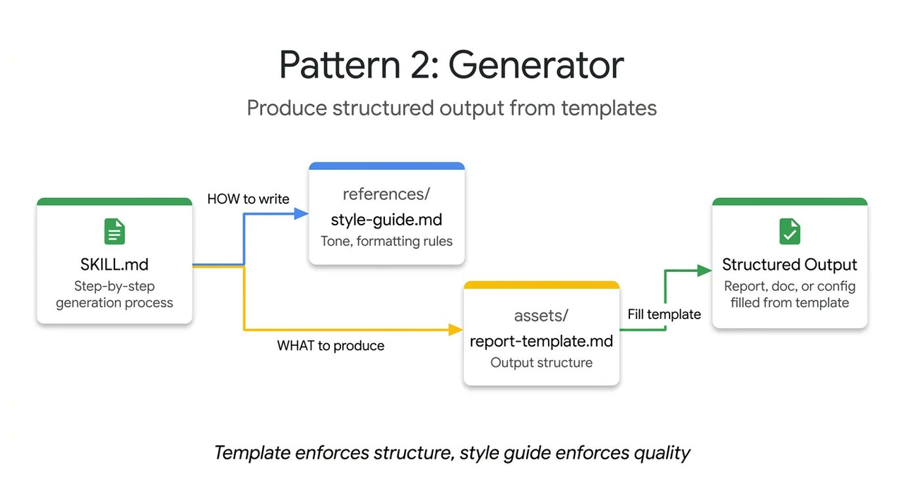

> 学习目标：掌握如何让 Skill 输出格式稳定，避免"今天一个样、明天另一个样"

---

## 引言

让 Agent 写 API 文档、写标准化报告、写 commit message，今天长这样、明天长成另一样。为什么？

因为模型每次都在现场重新决定：输出该长什么样？该包含哪些字段？该怎么组织？

**Generator 模式**解决的就是这个问题。

---

## 📚 核心问题

**输出格式不稳定。**

常见表现：

- API 文档格式不统一
- 报告结构每次都变
- commit message 时长时短
- 关键字段经常遗漏

---

## 💡 Generator 的解决方案

**核心思想**：把输出结构固定下来，让模型只需要填空。


**分三层设计**：

1. **模板**：固定结构（回答 what to produce）
   - 比如输出必须包含：标题、描述、参数、返回值、示例

2. **风格指南**：固定表达（回答 how to write）
   - 比如描述必须简洁明了、参数必须标注类型和是否必填

3. **SKILL.md**：先补问缺失变量，再把内容填进去
   - 如果用户没提供参数，先问清楚再生成

**价值**：模型不需要再猜测输出格式，只需要填空。

---

## 🔧 Generator SKILL.md 示例

### 场景 1：Commit Message 生成器

**SKILL.md 内容**：

````markdown
---
name: commit-message
description: Generate descriptive commit messages by analyzing git diffs. Use when the user asks for help writing commit messages or reviewing staged changes.
---

# Commit Message 生成器

## Commit message format

Generate commit messages following these examples:

**Example 1:**
Input: Added user authentication with JWT tokens
Output:
```
feat(auth): implement JWT-based authentication

Add login endpoint and token validation middleware
```

**Example 2:**
Input: Fixed bug where dates displayed incorrectly in reports
Output:
```
fix(reports): correct date formatting in timezone conversion

Use UTC timestamps consistently across report generation
```

**Example 3:**
Input: Updated dependencies and refactored error handling
Output:
```
chore: update dependencies and refactor error handling

- Upgrade lodash to 4.17.21
- Standardize error response format across endpoints
```

Follow this style: type(scope): brief description, then detailed explanation.
````

---

### 场景 2：API 文档生成器（带模板）

**SKILL.md 内容**：

````markdown
---
name: api-doc-generator
description: Generate API documentation from code or specifications. Use when creating API docs, endpoint documentation, or API reference guides.
---

# API Documentation Generator

## Template structure

**ALWAYS use this exact template structure:**

```markdown

## Overview
[One-paragraph description of what this endpoint does]

## Endpoint
`[HTTP Method] [path]`

## Parameters
| Name | Type | Required | Description |
|------|------|----------|-------------|
| [param] | [type] | Yes/No | [description] |

## Request Example
```json
{
  "[field]": "[example value]"
}
```

## Response
```json
{
  "[field]": "[example value]"
}
```

## Error Codes
| Code | Description |
|------|-------------|
| [code] | [description] |
```

## Style guide

- Use third person ("Returns user data", not "I will return")
- Parameters must include type and required status
- Include realistic example values
- Document all error codes
````
---

## 📌 经典案例

### 案例：Bug 报告生成器

**场景**：团队需要一个统一的 Bug 报告格式，便于追踪和分析。

**问题**：每次报告 Bug 时格式都不一样：
- 有人只写标题，不描述环境
- 有人描述了环境，但忘了写复现步骤
- 有人写了步骤，但期望结果和实际结果没对比

**Generator 方案**：

**SKILL.md 核心内容**：

````markdown
# Bug 报告生成器

## 必填字段模板

**BUG REPORT TEMPLATE**（必须严格遵循）：

```text
# Bug 报告

## 基本信息
- **标题**：[简短描述问题，不超过50字]
- **严重程度**：Critical / High / Medium / Low
- **发现时间**：YYYY-MM-DD HH:MM
- **报告人**：[姓名]

## 环境信息
- **操作系统**：[OS版本]
- **软件版本**：[版本号]
- **浏览器**：[浏览器版本，如适用]

## 复现步骤
1. [第一步操作]
2. [第二步操作]
3. [第三步操作]
...

## 期望结果
[应该发生什么]

## 实际结果
[实际发生了什么]

## 错误信息
[如果有错误提示，完整粘贴]

## 补充信息
[截图、日志、相关代码等]
```

## 补问机制

如果用户提供的信息不完整，必须询问：
- 缺少环境信息？ → "请提供操作系统和软件版本"
- 缺少复现步骤？ → "请详细描述如何触发这个 Bug"
- 缺少期望结果？ → "请说明应该发生什么"

## 示例

**输入**：登录页面有时会报错

**输出**（填空后）：

```text
# Bug 报告

## 基本信息
- **标题**：登录页面偶发错误提示
- **严重程度**：Medium
- **发现时间**：2024-01-15 14:30
- **报告人**：张三

## 环境信息
- **操作系统**：Windows 11
- **软件版本**：v2.3.1
- **浏览器**：Chrome 120.0

## 复现步骤
1. 打开登录页面
2. 输入用户名和密码
3. 点击登录按钮
4. 等待 5-10 秒

## 期望结果
成功登录，跳转到首页

## 实际结果
偶发（约 30% 概率）显示"服务器错误，请稍后重试"

## 错误信息
HTTP 500 Internal Server Error

## 补充信息
[错误截图 attached]
```

````
**案例解析**：

1. **模板固定结构**：明确了 Bug 报告必须包含的所有字段
2. **补问机制**：信息不完整时主动询问，而不是自己猜
3. **示例驱动**：提供完整的示例，让 Agent 学会填写格式
4. **一致性输出**：所有 Bug 报告格式统一，便于追踪和分析

**实际效果对比**：

| 方案 | 报告完整性 | 团队效率 |
|------|-----------|---------|
| 自由格式 | 45%（经常缺信息） | 需要反复追问 |
| Generator 模式 | 98%（结构完整） | 一份报告就够 |

**团队反馈**：
"以前处理 Bug 报告要来回问好几轮，现在一份报告就包含所有需要的信息，效率提升 5倍。"

---

## ✅ 适用场景

- **API 文档生成**：统一的接口文档格式
- **标准化报告**：周报、月报、项目报告
- **commit message**：符合团队规范的提交信息
- **任何格式固定的输出**：邮件模板、通知消息等

---

## 🎯 本节核心观点

**Generator 模式的三个关键**：

1. **模板固定结构**：明确输出必须包含哪些部分
2. **风格指南固定表达**：明确每一部分该怎么写
3. **示例驱动**：提供实际案例，让模型学会风格

---

## 🔗 下节预告

下一节我们学习 **Reviewer 模式**：如何分离审查与检查规则，让审查任务更灵活。

---

